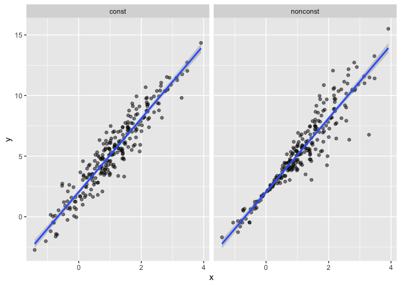

Bootstrapping
================
Lectured by Jeff Goldsmith
2022-11-17

``` r
knitr::opts_chunk$set(warning = FALSE, message = FALSE)

library(tidyverse)
```

    ## ── Attaching packages ─────────────────────────────────────── tidyverse 1.3.2 ──
    ## ✔ ggplot2 3.4.0      ✔ purrr   0.3.5 
    ## ✔ tibble  3.1.8      ✔ dplyr   1.0.10
    ## ✔ tidyr   1.2.1      ✔ stringr 1.4.1 
    ## ✔ readr   2.1.3      ✔ forcats 0.5.2 
    ## ── Conflicts ────────────────────────────────────────── tidyverse_conflicts() ──
    ## ✖ dplyr::filter() masks stats::filter()
    ## ✖ dplyr::lag()    masks stats::lag()

``` r
library(p8105.datasets)
library(modelr)
```

#### Bootstrapping

The idea of bootstrapping is to mimic repeated sampling with the one
sample we have. Our sample is randomly drawn from the population of
interest:  
- We would like to draw more samples, but we can’t do that in real
life.  
- So we draw a “*bootstrap sample*” from the one sample we have.  
- The bootstrap sample has the same size as the original sample, and is
drawn with replacement.  
- Analyze this sample using whatever approach we want to apply.  
- Repeat.

#### Why bootstrap?

The repeated sampling framework often provides useful theoretical
results under certain assumptions and/or asymptotics (like a limiting
behavior):  
- *Sample means*, *regression coefficients*, *odds ratios* follow a
known distribution.

If the assumptions are not met, or the sample size is not large enough,
we can’t use the “known distribution”. Bootstrapping gives us repeated
sampling, and uses an empirical rather than a theoretical distribution
for our statistic of interest.

#### Coding the bootstrap

Write a function(s) to:  
- Draw a sample with replacement  
- Analyze the sample  
- Return object of interest

Repeat this process many times.

### Simulate data

Let’s create a simulated data. First we will generate `x`, then an
`error` sampled from a normal distribution, and then a response `y`;
this all gets stored in `sim_df_const`. Then I’ll modify this by
multiplying the `errors` by a term that involves `x`, and create a new
response variable `y`.

``` r
n_samp = 250

sim_df_const = 
  tibble(
    x = rnorm(n_samp, 1, 1),
    error = rnorm(n_samp, 0, 1),
    y = 2 + 3 * x + error
  )

sim_df_nonconst = sim_df_const %>% 
  mutate(
  error = error * .75 * x,
  y = 2 + 3 * x + error
)
```

By generating data in this way, we are creating one case in which the
usual linear regression assumptions hold and one case in which they
don’t. The plot below illustrates the differences between the datasets.

``` r
sim_df = 
  bind_rows(const = sim_df_const, nonconst = sim_df_nonconst, .id = "data_source") 

sim_df %>% 
  ggplot(aes(x = x, y = y)) + 
  geom_point(alpha = .5) +
  stat_smooth(method = "lm") +
  facet_grid(~data_source) 
```

<!-- -->

These datasets have roughly the same overall variance, but the left
panel shows data with constant variance and the right panel shows data
with non-constant variance. For this reason, ordinary least squares
should provide reasonable estimates in both cases, but standard
inference approaches may only be justified for the data on the left. In
other words, we cannot compute confidence interval for the right panel
due to non-constant variance.

Let’s fit a linear regression to both datasets:

``` r
lm(y ~ x, data = sim_df_const) %>% 
  broom::tidy() %>% 
  knitr::kable(digits = 3)
```

| term        | estimate | std.error | statistic | p.value |
|:------------|---------:|----------:|----------:|--------:|
| (Intercept) |    2.038 |     0.096 |    21.145 |       0 |
| x           |    3.031 |     0.066 |    46.058 |       0 |

``` r
lm(y ~ x, data = sim_df_nonconst) %>% 
  broom::tidy() %>% 
  knitr::kable(digits = 3)
```

| term        | estimate | std.error | statistic | p.value |
|:------------|---------:|----------:|----------:|--------:|
| (Intercept) |    2.043 |     0.101 |    20.246 |       0 |
| x           |    3.035 |     0.069 |    44.045 |       0 |

Despite the very different error structures, standard errors for
coefficient estimates are similar in both cases!

We’ll use the bootstrap to make inference for the data on the right.
This is intended largely as an illustration for how to use the bootstrap
in cases where the theoretical distribution is “unknown”, although for
these data in particular weighted least squares could be more
appropriate.

#### Drawing one bootstrap sample

Write a function:

``` r
boot_sample = function(df) {
# sample_frac draws a sample from a particular proportion of the dataset.
  sample_frac(df, replace = TRUE)
# replace = TRUE meaning in this one bootstrap sample I might draw this same observation (ie. person #3) twice.
# This is okay because this mimics the error we will get when we draw another sample again from the same source population.
}
```

Check if the function works properly:

``` r
boot_sample(sim_df_nonconst) %>% 
  ggplot(aes(x = x, y = y)) + 
  geom_point(alpha = .3) +
  stat_smooth(method = "lm")
```

<!-- -->

That looks about right. In comparison with the original data, the
bootstrap sample has the same characteristics but isn’t a perfect
duplicate – some original data points appear more than once, others
don’t appear at all.

#### Drawing many bootstrap samples

We’re going to draw repeated samples with replacement, and then analyze
each of those samples separately. It would be really great to have a
data structure that makes it possible to keep track of everything. Maybe
a **list column**?

``` r
boot_straps = 
  data_frame(
    strap_number = 1:1000,
    strap_sample = rerun(1000, boot_sample(sim_df_nonconst)))
```

#### Analyzing bootstrap samples

Can I run my analysis on these?

``` r
boot_results = 
  boot_straps %>% 
  mutate(
    models = map(.x = strap_sample, ~lm(y ~ x, data = .x)), # Yes, it works!
    results = map(models, broom::tidy)) %>% 
  select(strap_number, results) %>% 
  unnest(results)
```

In the bootstrap samples, what is the actual standard deviation of the
all the estimates under repeated sampling?

``` r
boot_results %>% 
  group_by(term) %>% 
  summarize(
    mean_estimate = mean(estimate),
    sd_estimate = sd(estimate))
```

    ## # A tibble: 2 × 3
    ##   term        mean_estimate sd_estimate
    ##   <chr>               <dbl>       <dbl>
    ## 1 (Intercept)          2.05      0.0636
    ## 2 x                    3.04      0.0803

What is the distribution of `x`?

``` r
boot_results %>% 
  filter(term == "x") %>% 
  ggplot(aes(x = estimate)) +
  geom_density()
```

<!-- -->

The process of bootstrap is to mimic repeated sampling. We first take a
**sample** from the population, then we redraw many samples from that
**sample**.

The purpose of bootstrapping is to get an idea about the uncertainty in
the intercept and the slope across the samples. Regular linear
regression has a lot of assumptions and we know that in this example,
the constant variance assumption is violated. But these bootstrap
samples give us the actual standard error under repeated sampling
without assuming constant variance.

##### Computing 95% Confidence Interval

``` r
boot_results %>% 
  group_by(term) %>% 
  summarize(
    ci_lower = quantile(estimate, 0.025), 
    ci_upper = quantile(estimate, 0.975))
```

    ## # A tibble: 2 × 3
    ##   term        ci_lower ci_upper
    ##   <chr>          <dbl>    <dbl>
    ## 1 (Intercept)     1.93     2.17
    ## 2 x               2.88     3.19

### `modelr::bootstrap` function

Can we simplify things? Yes! The `modelr::bootstrap` function makes it
easy to draw bootstrap samples, and stores them in a mostly-helpful way
– as a `resample` object that can be converted to and treated like a
data frame. (This keeps us from having to actually store 1000
dataframes, and saves a lot of memory on our computer.)

So, how does the bootstrap function works?

``` r
# Give R a sample, and tell it how many bootstrap samples that we want.
boot_strap = 
  sim_df_nonconst %>% 
  bootstrap(1000, id = "strap_number") %>% # we are changing the originally named ".id" column to "strap_number"
  mutate(
    models = map(.x = strap, ~lm(y ~ x, data = .x)), # Yes, it works!
    results = map(models, broom::tidy)) %>% 
  select(strap_number, results) %>% 
  unnest(results)
```

``` r
boot_strap %>% 
  group_by(term) %>% 
  summarize(
    mean_estimate = mean(estimate),
    sd_estimate = sd(estimate))
```

    ## # A tibble: 2 × 3
    ##   term        mean_estimate sd_estimate
    ##   <chr>               <dbl>       <dbl>
    ## 1 (Intercept)          2.04      0.0649
    ## 2 x                    3.04      0.0843

Also, check this out – to bootstrap the dataset with constant error
variance, we only have to change the input dataframe!

``` r
sim_df_const %>% 
  bootstrap(n = 1000) %>% 
  mutate(
    models = map(strap, ~lm(y ~ x, data = .x)),
    results = map(models, broom::tidy)) %>% 
  select(-strap, -models) %>% 
  unnest(results) %>% 
  group_by(term) %>% 
  summarize(boot_se = sd(estimate))
```

    ## # A tibble: 2 × 2
    ##   term        boot_se
    ##   <chr>         <dbl>
    ## 1 (Intercept)  0.0882
    ## 2 x            0.0585
