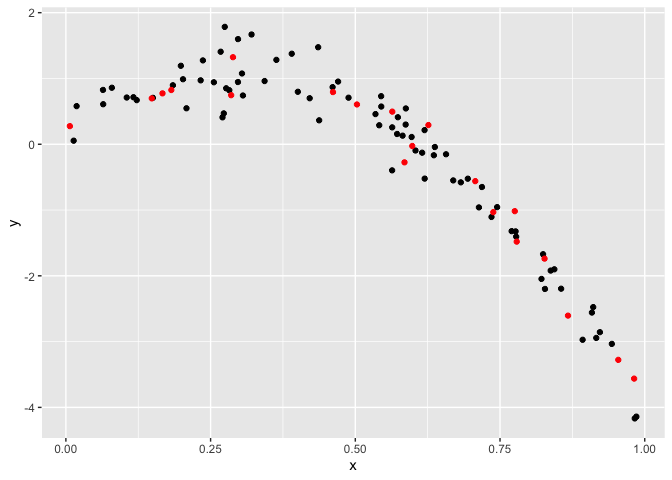
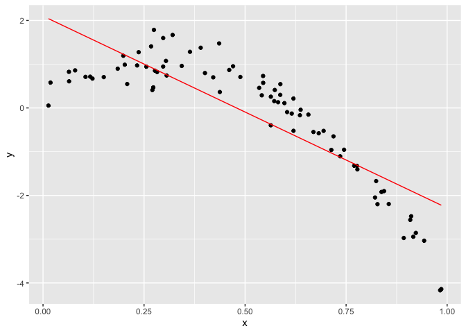
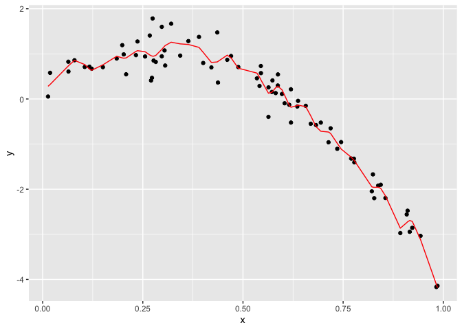
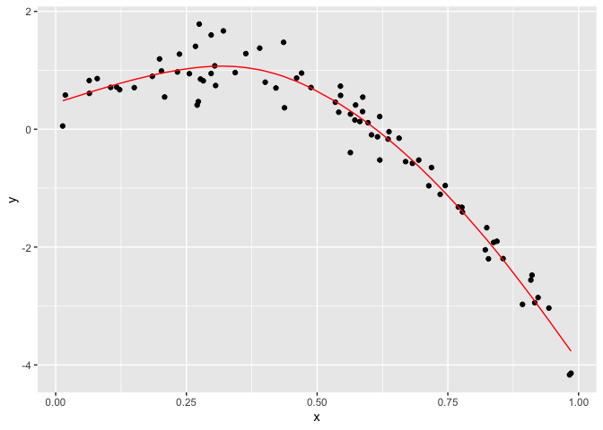

Cross Validation
================
Lectured by Jeff Goldsmith
2022-11-15

# Model selection

When you have lots of variables, you have to choose which ones will go
in your model.

For nested models, you have tests \* You have to be worried about
multiple comparisons and “fishiing”

For non-nested models, you don’t have tests \* AIC/BIC/etc are
traditional tools \* To understand what
[AIC](https://www.scribbr.com/statistics/akaike-information-criterion/)
is, click on it. \* Balance goodness of fit with “complexity”

# Cross validation

Randomly split your data into “training” and “testing” - “Training” is
data you use to build your model - “Testing” is data you use to evaluate
out-of-sample fit - Exact ratio depends on data size, but preferably
80/20

``` r
# Create a dataframe with 100 random nonlinear numbers (x-variable) and a y-variable that depends on x-variable.
nonlin_df = 
  tibble(
    id = 1:100,
    x = runif(100, 0, 1),
    y = 1 - 10 * (x - .3) ^ 2 + rnorm(100, 0, .3)
  )

nonlin_df %>% 
  ggplot(aes(x = x, y = y)) + 
  geom_point()
```

<!-- -->

``` r
train_df = sample_n(nonlin_df, 80)
test_df = anti_join(nonlin_df, train_df, by = "id")
```

``` r
train_df %>% 
  ggplot(aes(x = x, y = y)) + 
  geom_point() +
  geom_point(data = test_df, color = "red")
```

<!-- -->

Let’s try to fit three models.

``` r
linear_mod = lm(y ~ x, data = train_df)
smooth_mod = gam(y ~ s(x), data = train_df)
wiggly_mod = gam(y ~ s(x, k = 30), sp = 10e-6, data = train_df)
```

``` r
train_df %>% 
  add_predictions(linear_mod) %>% 
  ggplot(aes(x = x, y = y)) +
  geom_point() +
  geom_line(aes(y = pred), color = "red")
```

<!-- -->

``` r
train_df %>% 
  add_predictions(wiggly_mod) %>% 
  ggplot(aes(x = x, y = y)) +
  geom_point() +
  geom_line(aes(y = pred), color = "red")
```

<!-- -->

``` r
train_df %>% 
  add_predictions(smooth_mod) %>% 
  ggplot(aes(x = x, y = y)) +
  geom_point() +
  geom_line(aes(y = pred), color = "red")
```

<!-- -->
